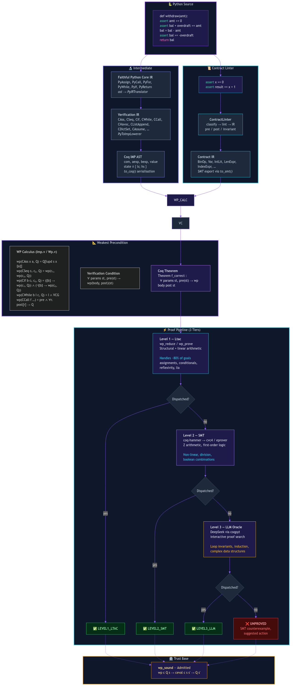

# axiomander 🦎

**A gold standard verification system for Python.** Write contracts as ordinary Python `assert` statements or verifier-only `axiomander:` docstring blocks — no runtime imports, decorators, or contract library required. The pipeline lowers Python to an IMP verification language, generates Coq proof obligations, proves the deterministic cases directly, dispatches harder residuals to SMT/Hammer, and falls back to a rocq-piler/LLM oracle.

```
Python asserts + axiomander docstrings
        │
        ▼
  contract_linter.py  →  Contract IR
        │
        ▼
  py_to_imp.py        →  IMP body
        │
        ▼
  Coq obligations     →  deterministic proof scripts (L1)
        │                                      │
        ▼                                      ▼
  residual obligations only              SMT/Hammer (L2)
                                                │
                                                ▼
                                      rocq-piler + LLM oracle (L3)
```

## Quick Start

```bash
git clone https://github.com/scidonia/axiomander
cd axiomander
uv pip install -e .

# Run the test suite
eval $(opam env)
PYTHONPATH=py .venv/bin/python -m pytest py/tests/ -v
```

## Usage

Axiomander supports two contract carriers:

1. ordinary Python `assert` statements, still useful for executable checks;
2. verifier-only `axiomander:` docstring blocks, preferred for ghost state, frames, and non-runtime specifications.

### Assert Contracts

Leading assertions are preconditions. Trailing assertions after the result assignment are postconditions. Loop-body assertions are invariants.

```python
def clamp(val: int, lo: int, hi: int) -> int:
    assert lo <= hi
    if val < lo:
        result = lo
    elif val > hi:
        result = hi
    else:
        result = val
    assert lo <= result <= hi
    assert implies(val < lo, result == lo)
    assert implies(val > hi, result == hi)
    return result
```

### Exception Contracts

Exceptions are modelled as **outcomes** — first-class values in the WP calculus. A function produces either `OReturn(result, final_state)` or `ORaise(exception_value, raise_state)`. Exception postconditions constrain what is true at the raise point.

Use the docstring `raises:` section — it is verifier-only and does not execute at runtime:

```python
def safe_divide(a: int, b: int) -> int:
    """
    axiomander:
        requires:
            a >= 0
            b >= 0
        ensures:
            result >= 0
        raises:
            ValueError: b == 0
    """
    if b == 0:
        raise ValueError
    result = a // b
    return result
```

The `raises:` section lists `ExcType: condition` pairs. Multiple exception types are each on their own line:

```text
axiomander:
    requires:
        n >= 0
    ensures:
        result >= 0
    raises:
        ValueError: n < 0
        OverflowError: n > 1000000
```

Internally, the postcondition becomes an outcome predicate:

```coq
fun o =>
  match o with
  | OReturn s => (* ensures condition *)
  | ORaise (VString "ValueError"%string) s => (* raises condition *)
  | _ => True
  end
```

### Dogfooding — Axiomander verifies its own code

Axiomander carries contracts on its own logic and verifies them. The
best example is `GoalStatus.is_proved` — the function that tells the
pipeline whether a verification goal passed:

```python
class GoalStatus:
    level: ProofLevel

    def is_proved(self) -> bool:
        """
        axiomander:
            ensures:
                implies(self.level == ProofLevel.UNPROVED,
                        result == 0)
                implies(self.level == ProofLevel.COUNTEREXAMPLE,
                        result == 0)
                implies(self.level != ProofLevel.UNPROVED
                        and self.level != ProofLevel.COUNTEREXAMPLE,
                        result == 1)
        """
        return self.level not in (
            ProofLevel.UNPROVED, ProofLevel.COUNTEREXAMPLE)
```

This proves at Level 1 (wp_reduce + lia).  The contract uses real enum
names (`ProofLevel.UNPROVED` — Axiomander resolves them to integer
encodings from the AST), `implies()` for each conditional case, and
`self.level` attribute access (auto-flattened to `self_level: Z`).

Other self-verified functions:

| Function | Level | What it proves |
|---|---|---|
| `GoalStatus.is_proved` (real) | 1 | Enum resolution + implies + `not in` tuple body |
| `classify_failure` (real) | 3 | String methods + `in` operator + branch priority |
| `_escape_field` | 3 | String replacement in body |

Remaining gaps are tracked in [the self-verification plan](docs/self-verification-plan.md).

### Docstring Contracts

Docstring contracts are verifier-only. They do not execute at runtime and are the preferred place for ghost bindings and frame declarations.

```python
def inc(x: int) -> int:
    """
    axiomander:
        requires:
            x >= 0
        modifies:
            none
        ensures:
            result == x + 1
    """
    result = x + 1
    return result
```

Supported sections:

```text
axiomander:
    where:
        old_a: int = a
    requires:
        a >= 0
    reads:
        a
    modifies:
        none
    ensures:
        result == old_a
    raises:
        ValueError: a < 0
```

`old(x)` is shorthand for a logical pre-state binding:

```python
def frame_old_unchanged(a: int) -> int:
    """
    axiomander:
        requires:
            a >= 0
        ensures:
            result == old(a)
    """
    discard = inc(5)
    result = a
    return result
```

This is equivalent to introducing a ghost binding `old_a = a`, but without adding any Python variable.

### Function Calls and Frames

`reads:` and `modifies:` describe a callee's frame. Callers may rely on variables outside `target :: modifies` being preserved.

```python
def inc(x: int) -> int:
    """
    axiomander:
        requires:
            x >= 0
        modifies:
            none
        ensures:
            result == x + 1
    """
    result = x + 1
    return result

def frame_two_calls(a: int, b: int) -> int:
    """
    axiomander:
        requires:
            a >= 0
            b >= 0
        ensures:
            a == old(a)
            b == old(b)
            result == a + b + 2
    """
    a2 = inc(a)
    b2 = inc(b)
    result = a2 + b2
    return result
```

For CCall-heavy functions, Axiomander generates decomposed Coq obligations: frame lemmas, one stage lemma per call, a post lemma, and a composition theorem using `wp_seq_decompose`.

### Loops and Quantifiers

Runtime `assert` statements remain the current source for loop invariants and many executable facts:

```python
def build_sorted(n: int):
    assert n >= 0
    result = []
    i = 0
    while i < n:
        assert len(result) == i
        assert i <= n
        assert all(result[j] == j for j in range(i))
        result.append(i)
        i += 1
    assert all(result[j] == j for j in range(n))
    return result
```

## Pipeline Tiers

| Level | Mechanism | What it handles |
|---|---|---|
| 1 — deterministic Coq | Generated obligations + bounded tactics | Assignments, conditionals, loops, decomposed CCall/frame obligations |
| 2 — SMT/Hammer | Per-obligation ATP/SMT fallback | Arithmetic and first-order residual goals |
| 3 — LLM oracle | rocq-piler + LLM | Residual proof repair over the same generated obligation file |

## Frame Conditions

Function calls use explicit frame information. A callee's docstring `modifies:` section becomes the CCall write set. The verifier proves that variables outside `target :: modifies` are unchanged across the call.

```python
def mutate(a: int) -> int:
    """
    axiomander:
        requires:
            a >= 0
        modifies:
            a
        ensures:
            result >= 0
    """
    result = a + 1
    return result
```

If a caller later tries to prove `a == old(a)` across `mutate(a)`, verification fails because `a` is declared writable.

Pure functions normally say:

```text
modifies:
    none
```

Library functions can also declare `reads`/`writes` in `.pyi` stubs. The docstring syntax and stub syntax both lower to the same internal contract map.

MCP tool `frame-report` shows contracts and frame conditions for any function.

## Testing

```bash
eval $(opam env)
PYTHONPATH=py .venv/bin/python -m pytest py/tests/ -v
```

124 tests covering arithmetic, loops, lists, dicts, sets, strings, class fields, predicates, function calls, docstring contracts, old-state syntax, reads/modifies frames, range quantifiers, stub integration, tuple/bytes/dict/set/None value comparisons, implication, loop-predicate contract inlining, exception contracts, validate_assignment enforcement, nested Pydantic models, constructor CCalls, and collection fields.

## Dependencies

| Tool | Purpose |
|---|---|
| Python ≥ 3.10 | Runtime + test harness |
| OCaml ≥ 5.2 + Coq ≥ 9.0 | Proof kernel |
| dune | OCaml/Coq build |
| cvc4 or cvc5 | SMT solver (Level 2) |
| z3 | SMT solver (Level 2 — preferred for string/float theories) |
| coqpyt | Interactive Coq proof session (LLM oracle) |

## MCP Setup

Axiomander exposes its tools as an MCP server. Wire it into your editor for inline verification.

**Cursor / VS Code / Claude Desktop** — add to your MCP config (`~/.cursor/mcp.json`, `~/.vscode/mcp.json`, or `claude_desktop_config.json`):

```json
{
  "mcpServers": {
    "axiomander": {
      "command": "uv",
      "args": ["run", "python", "-m", "oracle.mcp_server"],
      "cwd": "/path/to/axiomander",
      "env": {
        "AXIOMANDER_ROOT": "/path/to/axiomander",
        "DEEPSEEK_API_KEY": "sk-...",
        "PATH": "/usr/bin:/bin:/usr/local/bin"
      }
    }
  }
}
```

**Tools exposed:**

| Tool | What it does |
|---|---|
| `check-file` | Analyze a file for contract adornment opportunities |
| `check-function` | Verify a single function (Level 1) + suggest contracts |
| `verify-function` | Full verification (Level 1 → 2 → 3) |
| `verify-changed` | Incremental — re-verify only changed functions |
| `verify-impacted` | Dry-run — show what would be re-verified |
| `explain-cache` | Show cache state for a function |
| `frame-report` | Show pre/post/invariant + frame conditions |

**Requirements:** `uv` installed, `eval $(opam env)` in the environment. The MCP server starts Coq and SMT on demand. First verification run compiles Coq (a few seconds); subsequent runs use the cache (milliseconds).

## Architecture



```
py/
  oracle/
    contract_linter.py   # Python AST → IR (Coq + SMT targets)
    contract_ir.py       # Expression IR (Pydantic models)
    python_to_imp.py     # Python AST → IMP commands
    mcp_server.py        # MCP server + all tools
    purity_analyzer.py   # Purity detection + frame condition generation
    stub_loader.py       # .pyi stub parser for library contracts
    cache.py             # Incremental verification cache + dependency graph
    smt_export.py        # Coq → SMT-LIB export
    client.py            # LLM oracle client
    coqpyt_session.py    # Interactive Coq proof session
    reporting.py         # Goal status + report generation

coq/
  Imp.v                  # IMP language (value: VZ | VBool | VUnit), clobber
  Wp.v                   # WP calculus with CCall writes enforcement
  WpTactics.v            # wp_reduce/wp_prove/frame_prove automation
  Pydantic.v             # Pydantic model support (store_field, load_field)
stubs/
  builtins.pyi           # Stub contracts for pop, add, get, len, etc.
  math_stubs.pyi         # Stub contracts for math functions
```

## Contract Discipline

- **Type annotations** carry contracts: `x: int` constrains the parameter type, `-> bool` constrains the return value
- **`assert`** captures what types can't: `assert len(lst) > 0`, `assert depth >= 0`
- **`if __debug__:`** marks ghost snapshots: `if __debug__: old_x = x`. Stripped by `python -O`.
- **`python -O`** strips all assert statements and `if __debug__:` blocks. Verification has zero production overhead.
- **Contracts** document pre/post/invariant in docstrings
- **SMT counterexamples** tell you exactly what's missing from weak invariants
- **Loop predicates** are verified as standalone functions. Their semantic postconditions (guarded by `implies(result == 1, ...)`) are inlined at call sites. Pure predicates are inlined directly; predicates without postconditions are rejected.
