# Axiomander Architecture

```mermaid
%%{init: {'theme': 'dark', 'themeVariables': {
  'fontSize': '14px',
  'primaryColor': '#7c3aed',
  'primaryTextColor': '#f5f3ff',
  'primaryBorderColor': '#a78bfa',
  'lineColor': '#8b5cf6',
  'secondaryColor': '#1e1b4b',
  'tertiaryColor': '#312e81',
  'noteBkgColor': '#1e293b',
  'noteTextColor': '#e2e8f0',
  'actorBkg': '#7c3aed',
  'actorBorder': '#a78bfa',
  'actorTextColor': '#f5f3ff',
  'signalColor': '#94a3b8',
  'signalTextColor': '#e2e8f0',
  'labelBoxBkgColor': '#1e293b',
  'labelBoxBorderColor': '#475569',
  'labelTextColor': '#cbd5e1',
  'loopTextColor': '#e2e8f0',
  'activationBkgColor': '#312e81',
  'activationBorderColor': '#6366f1'
}}}%%

flowchart TB
    subgraph SOURCE["🐍 Python Source"]
        direction TB
        PY["def withdraw(amt):<br/>  <span style='color:#34d399'>assert</span> amt &gt;= 0<br/>  <span style='color:#34d399'>assert</span> bal + overdraft &gt;= amt<br/>  bal = bal - amt<br/>  <span style='color:#34d399'>assert</span> bal &gt;= -overdraft<br/>  <span style='color:#f472b6'>return</span> bal"]
    end

    subgraph IR["🔬 Intermediate Representations"]
        direction LR
        PYIR["<b>Faithful Python Core IR</b><br/>PyAssign, PyCall, PyFor,<br/>PyWhile, PyIf, PyReturn<br/><br/><i>ast → PyIRTranslator</i>"]
        IMPIR["<b>Verification IR</b><br/>CAss, CSeq, CIf, CWhile,<br/>CCall, CHavoc, CListAppend,<br/>CDictSet, CAssume, …<br/><br/><i>PyToImpLowerer</i>"]
        COQ["<b>Coq IMP AST</b><br/>com, aexp, bexp, value<br/>state ≜ { ls; hs }<br/><br/><i>to_coq() serialisation</i>"]
    end

    subgraph CONTRACTS["📜 Contract Linter"]
        direction LR
        ASSERT["<span style='color:#34d399'>assert</span> x &gt;= 0<br/><span style='color:#34d399'>assert</span> result == x + 1"]
        LINT["<b>ContractLinter</b><br/>classify → lint → IR<br/>pre / post / invariant"]
        IR_EXPR["<b>Contract IR</b><br/>BinOp, Var, IntLit,<br/>LenExpr, IndexExpr, …<br/><br/><i>SMT export via to_smt()</i>"]
    end

    subgraph WP["📐 Weakest Precondition"]
        direction TB
        WP_CALC["<b>WP Calculus (Imp.v / Wp.v)</b><br/>wp(CAss x a, Q) = Q[lupd s x ⟦a⟧]<br/>wp(CSeq c₁ c₂, Q) = wp(c₁, wp(c₂, Q))<br/>wp(CIf b c₁ c₂, Q) = (⟦b⟧ → wp(c₁, Q)) ∧ (¬⟦b⟧ → wp(c₂, Q))<br/>wp(CWhile b I c, Q) = I ∧ VCG-exit ∧ VCG-body<br/>wp(CCall …) = pre s ∧ ∀r. post(s[result↦r]) → …"]
        VC["<b>Verification Condition</b><br/>params → pre → wp(body, post, init_state)"]
    end

    PROOF["<b>Coq Theorem</b><br/>Theorem fn_correct : ∀ params,<br/>&nbsp;&nbsp;pre → wp body post init_state."]

    subgraph PIPELINE["⚡ Proof Pipeline (3 Tiers)"]
        direction TB
        L1["<b>Level 1 — Ltac</b><br/>wp_reduce / wp_prove<br/>Structural + linear arithmetic<br/><br/><span style='color:#22d3ee'>Handles ~80% of goals</span><br/>assignments, conditionals,<br/>reflexivity, lia"]
        L1_CHECK{"Dispatched?"}
        L1_DONE["✅ <b>LEVEL1_LTAC</b>"]

        L2["<b>Level 2 — SMT</b><br/>coq-hammer → cvc4 / eprover<br/>Z arithmetic, first-order logic<br/><br/><span style='color:#22d3ee'>Non-linear, division,<br/>boolean combinations</span>"]
        L2_CHECK{"Dispatched?"}
        L2_DONE["✅ <b>LEVEL2_SMT</b>"]

        L3["<b>Level 3 — LLM Oracle</b><br/>DeepSeek via coqpyt<br/>interactive proof search<br/><br/><span style='color:#fbbf24'>Loop invariants, induction,<br/>complex data structures</span>"]
        L3_CHECK{"Dispatched?"}
        L3_DONE["✅ <b>LEVEL3_LLM</b>"]
        L3_FAIL["❌ <b>UNPROVED</b><br/><span style='color:#f87171'>SMT counterexample,<br/>suggested action</span>"]
    end

    subgraph SOUNDNESS["🏛️ Trust Base"]
        WP_SOUND["<b>wp_sound</b> — Admitted<br/>wp c Q s → ceval c s s' → Q s'"]
    end

    SOURCE --> PYIR
    SOURCE --> ASSERT
    PYIR --> IMPIR
    IMPIR --> COQ
    ASSERT --> LINT
    LINT --> IR_EXPR
    COQ --> WP_CALC
    IR_EXPR --> WP_CALC
    WP_CALC --> VC
    VC --> PROOF

    PROOF --> L1
    L1 --> L1_CHECK
    L1_CHECK -- "yes" --> L1_DONE
    L1_CHECK -- "no" --> L2
    L2 --> L2_CHECK
    L2_CHECK -- "yes" --> L2_DONE
    L2_CHECK -- "no" --> L3
    L3 --> L3_CHECK
    L3_CHECK -- "yes" --> L3_DONE
    L3_CHECK -- "no" --> L3_FAIL

    L1_DONE -.-> WP_SOUND
    L2_DONE -.-> WP_SOUND
    L3_DONE -.-> WP_SOUND
    L3_FAIL -.-> WP_SOUND

    style SOURCE fill:#0f172a,stroke:#7c3aed,stroke-width:2px,color:#e2e8f0
    style IR fill:#0f172a,stroke:#6366f1,stroke-width:2px,color:#e2e8f0
    style CONTRACTS fill:#0f172a,stroke:#06b6d4,stroke-width:2px,color:#e2e8f0
    style WP fill:#0f172a,stroke:#8b5cf6,stroke-width:2px,color:#e2e8f0
    style PIPELINE fill:#0f172a,stroke:#22d3ee,stroke-width:2px,color:#e2e8f0
    style SOUNDNESS fill:#0f172a,stroke:#f59e0b,stroke-width:2px,color:#e2e8f0

    style PY fill:#1e1b4b,stroke:#7c3aed,color:#e2e8f0
    style PYIR fill:#1e293b,stroke:#818cf8,color:#cbd5e1
    style IMPIR fill:#1e293b,stroke:#818cf8,color:#cbd5e1
    style COQ fill:#1e293b,stroke:#818cf8,color:#cbd5e1
    style ASSERT fill:#1e1b4b,stroke:#06b6d4,color:#e2e8f0
    style LINT fill:#1e293b,stroke:#22d3ee,color:#cbd5e1
    style IR_EXPR fill:#1e293b,stroke:#22d3ee,color:#cbd5e1
    style WP_CALC fill:#1e1b4b,stroke:#a78bfa,color:#e2e8f0
    style VC fill:#1e293b,stroke:#a78bfa,color:#cbd5e1
    style PROOF fill:#1e1b4b,stroke:#c084fc,color:#e2e8f0

    style L1 fill:#1e1b4b,stroke:#22d3ee,color:#e2e8f0
    style L1_CHECK fill:#1e293b,stroke:#475569,color:#cbd5e1
    style L1_DONE fill:#052e16,stroke:#22c55e,color:#86efac
    style L2 fill:#1e1b4b,stroke:#a78bfa,color:#e2e8f0
    style L2_CHECK fill:#1e293b,stroke:#475569,color:#cbd5e1
    style L2_DONE fill:#052e16,stroke:#22c55e,color:#86efac
    style L3 fill:#1e1b4b,stroke:#fbbf24,color:#e2e8f0
    style L3_CHECK fill:#1e293b,stroke:#475569,color:#cbd5e1
    style L3_DONE fill:#052e16,stroke:#22c55e,color:#86efac
    style L3_FAIL fill:#450a0a,stroke:#ef4444,color:#fca5a5

    style WP_SOUND fill:#1e1b4b,stroke:#f59e0b,color:#fde68a
    style SOUNDNESS fill:#0f172a,stroke:#f59e0b,stroke-width:2px,color:#e2e8f0
```



## Pipeline Flow

```
Python Source
    │
    ├─► PyIRTranslator ──► Faithful Python Core IR (PyIR)
    │                           │
    │                    PyToImpLowerer
    │                           │
    │                           ▼
    ├─► ContractLinter ──► Contract IR ◄── Verification IR (ImpIR)
    │         │                    │              │
    │    pre / post /        to_smt()       to_coq()
    │    invariant               │              │
    │         │                    │              ▼
    │         ▼                    ▼         Coq IMP AST
    │    Coq predicates      SMT-LIB v2     (com, aexp, bexp, value)
    │         │                    │              │
    │         └────────────────────┼──────────────┘
    │                              │
    │                         WP Calculus
    │                              │
    │                    Verification Condition
    │                              │
    │                        Coq Theorem
    │                              │
    └──────────────────────────────┘
                                   │
                          ┌────────┴────────┐
                          ▼                  ▼
                    Level 1: Ltac      Level 2: SMT
                    wp_reduce/prove    cvc4 / eprover
                          │                  │
                          └────────┬─────────┘
                                   ▼
                            Level 3: LLM
                            DeepSeek oracle
```

## Key Types

| Type | Role |
|------|------|
| `state` | Record `{ ls: var → value; hs: (var×var) → value }` |
| `value` | `VZ Z \| VString string \| VFloat R \| VNone \| VTuple list \| VList list \| VDict list \| …` |
| `com` | IMP commands: `CSkip \| CAss \| CSeq \| CIf \| CWhile \| CCall \| CHavoc \| CAssume \| …` |
| `assertion` | `state → Prop` |
| `wp` | `com → assertion → assertion` |

## File Map

```
coq/Imp.v          State model, aeval/beval, ceval, clobber
coq/Wp.v           Weakest-precondition calculus, wp_sound
coq/WpTactics.v    wp_reduce, wp_prove, clobber lemmas, ccall_simpl
py/oracle/
  py_ir.py         PyIR nodes (PyAssign, PyCall, PyFor, …)
  py_ir_translator.py  ast → PyIR
  imp_ir.py        ImpIR nodes (CAss, CCall, CListAppend, …)
  py_to_imp.py     PyIR → ImpIR lowerer
  contract_ir.py   Contract expressions + to_coq() / to_smt()
  contract_linter.py   Lint + classify assert statements
  mcp_server.py    Pipeline orchestration, Coq generation, SMT export
```
