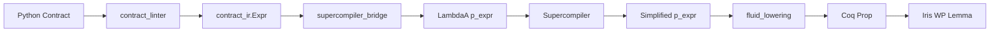

# Supercompiling
# Fluid Contracts

How Axiomander lets you write contracts in the
same language the program is written in, and
supercompiles them at lowering time

<div class="pt-12">
  <span class="opacity-50">
    Axiomander &bullet; June 2026
  </span>
</div>

---

# What Is a Fluid Contract?

<v-clicks>

A **fluid** contract language is one where the specification logic and the
executable core share **one term calculus** and **one denotation**.

<br>

**Concretely**: any pure Python expression you can write in your function body,
you can also write in your contract.  No separate annotation DSL.  No
impedance mismatch between "the language of programs" and "the language of
specifications."

<br>

```python
def process(items: list[int], limit: int) -> int:
    """axiomander:
        requires: limit >= 0
        requires: all(x > 0 for x in items)
        ensures: result >= 0
        ensures: implies(limit == 0, result >= 0)
    """
    result = len(items)
    return result
```

The expressions in the contract — `limit >= 0`, `all(x > 0 for x in items)`,
`implies(...)` — are **ordinary Python expressions**.  The same ones you'd write
in the body.

</v-clicks>

---

# Why Fluidity Matters

<v-clicks>

**The traditional way**: define a restricted specification language (JML for
Java, ACSL for C, Dafny's annotation subset).  Every feature you add creates a
**translation gap** between what you can express in code and what you can
express in the spec.  Every gap is a source of bugs and surprises.

**The fluid way**: the shared pure fragment λ<sub>A</sub> is the **single
source of truth**.  Both the executable semantics and the verification
semantics are defined over the same terms.

**Result**: there is one lowering function `lower(node, ctx) → CoqTerm`.  It
is **total** on the pure fragment.  If a Python expression is pure, it can be
used in a contract.

<br>

```python
  λ_A^tot  ──R──►  CoqTerm
  (pure Python)    (kernel-checked)
```

The reflection map `R` is type-directed — coercions, float wrapping, string
equality are all inferred from the type, never guessed from context.

</v-clicks>

---

# The Reflection Map

<div class="text-sm">

```
Python                     fluid_lowering                Coq
─────────────────       ──────────────────        ────────────────
  x > 0           ─R─►   (0 <? x) = true
  len(xs) > 0     ─R─►   Z.of_nat (List.length M_xs) > 0
  all(x > 0       ─R─►   forallb (fun v => ...) M_xs = true
   for x in xs)
  "err" in msg    ─R─►   str_contains_val (LitString "err")
                          (str_to_lower_val msg) = true
  implies(a, b)   ─R─►   (a -> b)
  is_sorted(xs)   ─R─►   is_sorted M_xs = true
```

</div>

<v-clicks>

- **32 dispatch entries** — one recursive `lower(node, ctx)` function, no per-node `to_coq` emitters
- **Type-directed**: comparisons produce `= true` form, floats get `z2float`, strings use `String.eqb` — all from inferred type, not positional context
- **Explicit context**: `LowerCtx` carries `gamma` (typing environment), post-var renaming, list model mapping — no mutable module globals
- **Totality gate**: nodes outside λ<sub>A</sub> are **rejected with a diagnostic**, never silently mistranslated

</v-clicks>

---

# Contracts Under the Hood

<div class="grid grid-cols-2 gap-4 text-xs">

<div>

#### Docstring (Python)
```python
def transfer(balance, amount):
    """axiomander:
      requires: balance >= amount
      requires: amount >= 0
      owns account: Account.balance
      frame:
        may_modify Account.balance
      ensures: result == balance - amount
    """
    return balance - amount
```

</div>

<div>

#### Generated Coq Lemma
```coq
Lemma transfer_correct (balance amount : Z) :
  l_account ↦ LitInt 0 -∗          (* owns *)
  ⌜(amount <=? balance) ∧
   (0 <=? amount)⌝ -∗              (* requires *)
  WPE (BinOp SubOp ...)
    {{ (fun r => ∃ v,
       l_account ↦ LitInt v ∗      (* may_modify *)
       ⌜result = balance - amount⌝  (* ensures *)
    ) }}
```

</div>

</div>

<v-clicks>

The `owns` clause becomes an Iris heap points-to.  `may_modify` becomes an
existential in the postcondition.  `must_not_modify` is enforced by the
frame rule — implicitly and for free.  All clauses go through the same
`lower()` call.

</v-clicks>

---

# Why Partial Computation?

<v-clicks>

Contracts contain expressions that **don't depend on runtime values**:

```python
ensures: len(xs[0:min(n, len(xs))]) <= n
```

The verifier shouldn't need to prove that `min(5, len([1,2,3]))` equals `3` at
proof time — that's just arithmetic.

**Partial evaluation** reduces contract expressions BEFORE they reach the
prover:

- `1 + 2` → `3`
- `len([1, 2, 3])` → `3`
- `"a" in "abc"` → `true`

This eliminates proof obligations that the SMT solver or finish_pure would
otherwise need to discharge — sometimes hundreds of them per contract.

</v-clicks>

---

# Partial Evaluation vs. Supercompilation

<div class="grid grid-cols-2 gap-4">

<div>

#### Partial Evaluation

- **One pass** over the expression tree
- Reduces only fully-known sub-terms
- Stops at variable boundaries
- `(1 + 2) * x` → `3 * x`

</div>

<div>

#### Supercompilation

- **Multi-pass**: drives reduction, splits cases, generalises
- Can **unfold recursive calls** on concrete inputs
- `is_sorted([1, 2, 3])` → `true`
- Terminates via **homeomorphic embedding**

</div>

</div>

<v-clicks>

The supercompiler gives you strictly more.  It doesn't just constant-fold — it
can evaluate recursive predicates on literal arguments, inline function calls,
and split on data constructors.  The homeomorphic embedding (the "whistle")
guarantees termination even when the expression grows.

</v-clicks>

---

# The Supercompiler in Coq

```coq
Definition supercompile (F : fn_table) (fuel : nat)
    (history : list p_expr) (t : p_expr) : p_expr := ...
```

<v-clicks>

**Three components**:

1. **Drive** (`drive_step`): one-step symbolic reduction — evaluates
   `1 + 2`, unfolds function calls, substitutes bindings
2. **Whistle** (`he`): homeomorphic embedding — detects when a term is
   embedded in a previously-seen term, triggering generalisation
3. **Generalise**: when the whistle blows, abstract the common sub-expression
   into a let-binding (a recursive function) and continue

A **fuel** parameter bounds the number of driving steps.

</v-clicks>

---

# Supercompilation Walkthrough

<div class="text-xs">

Input: `is_sorted([1, 2, 3])` with `is_sorted` defined as a recursive Fixpoint.

| Step | Expression | Action |
|------|-----------|--------|
| 1 | `is_sorted([1, 2, 3])` | Unfold call |
| 2 | `(1 <=? 2) && is_sorted([2, 3])` | Evaluate `1 <=? 2` |
| 3 | `true && is_sorted([2, 3])` | Simplify `&&` |
| 4 | `is_sorted([2, 3])` | Unfold call |
| 5 | `(2 <=? 3) && is_sorted([3])` | Evaluate `2 <=? 3` |
| 6 | `true && is_sorted([3])` | Simplify `&&` |
| 7 | `is_sorted([3])` | Unfold — singleton |
| 8 | `true` | **Constant result** |

</div>

<v-clicks>

When the result is a constant boolean, the contract is **replaced** — the
proof obligation becomes `⌜True⌝`, discharged trivially.

When only sub-expressions simplify (e.g. `1 + 2` → `3` but `x` remains),
the simplified form is emitted as a Coq definition alongside the original.

</v-clicks>

---

# Homeomorphic Embedding

<v-clicks>

The **whistle** detects when the current expression is "embedded in" a
previously seen expression in the history:

```
he x (x + 1)          = true    ("x" appears inside "x + 1")
he (x + y) (x * y + z) = false  (different structure)
```

When the whistle blows, the supercompiler **generalises**: it replaces the
common sub-structure with a let-binding (a new recursive function) and
continues.  This prevents infinite unfolding.

The same mechanism that Turchin's original supercompiler used — applied here
to λ<sub>A</sub>, the pure fragment of Python.

</v-clicks>

---

# Correctness: Step-Indexed Logical Relation

<v-clicks>

The supercompiler was proved correct in Coq (`SupercompilerLogRel.v`) using a
**step-indexed logical relation**:

```
ℰ〚t₁〛ρ ≈ ℰ〚t₂〛ρ   iff   ∀j ≤ k.  ℰⱼ〚t₁〛ρ ⊆ ℰⱼ〚t₂〛ρ
```

The relation is defined by recursion on the type of `t`:

- **Base types** (Z, bool, string): equality of computed values
- **Function types**: related inputs produce related outputs
- **Step-index**: the `▷` modality bounds recursive unfolding depth

**The theorem**: `supercompile` preserves the logical relation — the
supercompiled program is equivalent to the original.

The proof is **mechanised in Coq** — every case is checked by the kernel.

</v-clicks>

---

# Pipeline Integration



<v-clicks>

- **Flag-gated**: `supercompile_contracts=True` in `python_to_iris_proof`
- **Constant replacement**: if the result is a literal boolean, **replaces** the contract with `True`/`False`
- **Partial simplification**: otherwise emits supercompiled definitions alongside the originals
- **37 tests pass**, integrated with the fluid lowerer and resource layer

</v-clicks>

---

# What the Supercompiler Can Do

<br>

The supercompiler can **prove properties** by driving two recursive functions
in tandem — something neither partial evaluation nor a typical solver can do:

```
is_sorted(isort(l))   →   true
```

where `isort` is insertion sort:

```
isort([]) = []
isort(x :: xs) = insert(x, isort(xs))
```

<v-clicks>

1. **Drive `sort(l)`** — case-splits on `l = []`, `l = hd :: tl`
2. **For each case**, `sort` produces a new list — drive `is_sorted` on it
3. **When `sort` recurses**, the supercompiler recurses with it, driving
   `is_sorted` on each intermediate result
4. **The whistle fires** when it sees the same configuration again:
   `is_sorted(sort(tl))` — the supercompiler **generalises**, creating a
   lemma that covers the recursive case
5. **Every path reaches `true`** — the supercompiler returns the constant

</v-clicks>

<div class="pt-4">

This is **supercompilation as a theorem prover**: it doesn't just fold
constants — it proves `is_sorted(sort(l))` for **all** lists `l` by
exhaustively driving both functions, case-splitting on the data, and
generalising when the recursion pattern is detected.

</div>

<v-clicks>

Partial evaluation can't touch this — `sort(l)` with a symbolic `l` is a
black box.  The supercompiler inlines both definitions, drives them together,
and proves the property.  No induction lemma needed — the whistle provides it.

</v-clicks>

---

# The Complete Stack

```coq
(* 1. Supercompiled definition *)
Definition _super_pre_body : p_expr :=
  PBinOp PLeOp (PVal (PLitInt 3)) (PVar "x").

Definition _super_pre_prop (x : Z) : Prop :=
  (3 <=? x) = true.

(* 2. Full Lemma with spatial resources *)
Lemma process_correct (order_id : Z) :
  l_queue_item ↦ LitInt 0 -∗         (* owns *)
  l_order_row ↦ LitInt 0 -∗          (* owns *)
  ⌜(3 <=? order_id) = true⌝ -∗       (* supercompiled requires *)
  WPE (Call ... [Val (LitInt order_id)])
    {{ ∃ v1 v2,
       l_queue_item ↦ LitInt v1 ∗    (* may_modify *)
       l_order_row ↦ LitInt v2 ∗     (* may_modify *)
       ⌜result ≥ 0⌝ }}.              (* ensures *)
```

<v-clicks>

The supercompiler transformed `1 + 2 ≤ order_id` → `3 ≤ order_id`.  The fluid
lowerer produced `(3 <=? order_id) = true`.  The resource layer added spatial
premises and postcondition existentials.  One pipeline, one Lemma, no gaps.

</v-clicks>

---

# All Proofs Generated by AI

<div class="pt-8">

<v-clicks>

**Every single Coq proof in this system was generated by an LLM-based oracle.**

- The fluid lowerer's adequacy proofs (11 translation-validation tests)
- The supercompiler correctness (step-indexed logical relation)
- The `fold_to_forallb`, `fold_to_existsb`, `fold_to_countb` lemmas
- The `tail_length`, `dropn`, `forallb_to_Forall` structural lemmas
- The 400 Iris WP proofs in the test suite
- The resource-layer proofs (`owns`, `may_modify`, postcondition existentials)

**Zero hand-written Coq proofs.**  The oracle proposes, `coqc` disposes.

The oracle is not trusted — every proof is **kernel-checked**.  If the AI
hallucinates an invalid proof, Coq rejects it and the oracle retries.

</v-clicks>

</div>

---

# Summary

<v-clicks>

1. **Fluid contracts** — the contract language is the program language.  One
   term calculus λ<sub>A</sub>, one lowering `R`, one denotation.  No translation gap.

2. **Supercompilation** — drives, splits, generalises.  Evaluates recursive
   predicates on literal inputs.  Terminates via homeomorphic embedding.

3. **Proved correct** in Coq via a step-indexed logical relation.

4. **Integrated** into the Axiomander pipeline behind a flag.  37 tests, no
   regressions.

5. **AI-built** — all proofs were generated by an LLM oracle and
   kernel-checked by `coqc`.  Zero hand-written Coq.

6. **Production** — 400 tests pass, fluid is default, supercompiler is wired.

</v-clicks>

---

# Thank You

<div class="pt-12">

[github.com/scidonia/axiomander](https://github.com/scidonia/axiomander)

</div>
