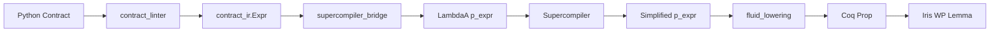

# Fluid Contracts
## and the Supercompiler

How Axiomander builds a total, type-directed contract language
and supercompiles it for free

<div class="pt-12">
  <span class="px-2 py-1 rounded cursor-pointer">
    Axiomander &bullet; June 2026
  </span>
</div>

---

# What "Fluid" Means

<v-clicks>

The specification language **is** the program language.

<br>

**Fluid**: any pure term of the program language is also a term of the specification logic.

<br>

No separate annotation DSL.  No impedance mismatch.  No subset that "can be reasoned about" — the **same** expressions appear in contracts and code.

</v-clicks>

---

# Fluid in Practice

<div class="grid grid-cols-2 gap-4">

<div>

#### Contract (Python)
```python
def binary_search(xs, key):
    """axiomander:
      requires: is_sorted(xs)
      ensures:
        result == any(x == key
                      for x in xs)
    """
    while lo <= hi:
        mid = (lo + hi) // 2
        if xs[mid] == key:
            return True
        if xs[mid] < key:
            lo = mid + 1
        else:
            hi = mid - 1
    return False
```

</div>

<div>

#### Lowered (Coq)
```coq
Lemma binary_search_correct
  (xs : sn_val) (key : Z) ... :
  (is_sorted M_xs) = true ->
  ⊢ WPE ... {{
    ∃ z, v = LitBool z ∧
    (z =? 1) = true <->
    existsb (fun x => x =? key)
            M_xs = true
  }}
```

</div>

</div>

The Python expression `any(x == key for x in xs)` **becomes** the Coq specification — one lowering, no translation layers.

---

# Why Not Just a Subset Language?

<v-clicks>

**The traditional approach**: define a restricted specification language (JML, ACSL, Dafny's subset).

**Problem**: every feature you add creates a **translation gap**.  Every gap is a source of bugs.

**The fluid approach**: the shared term calculus λ<sub>A</sub> is the **single source of truth**.  Both execution and verification semantics are defined over it.

**Result**: the reflection map `R : λ_A → CoqTerm` is **total** and **type-preserving**.  No "this expression can't be used in a contract" rejections.

</v-clicks>

---

# The Reflection Map R

<div class="text-sm">

```
Python expression            fluid_lowering.py              Coq Prop
─────────────────          ──────────────────           ────────────
  x > 0          ──R──►    (0 <? x) = true
  len(xs) > 0    ──R──►    Z.of_nat (List.length M_xs) > 0
  all(x > 0      ──R──►    forallb (fun v => ...) M_xs = true
   for x in xs)
  "err" in msg   ──R──►    str_contains_val (LitString "err")
                            (str_to_lower_val msg) = true
  implies(a,b)   ──R──►    (a -> b)
```

</div>

<v-clicks>

- **32 dispatch entries** — one `lower(node, ctx)` function
- **Type-directed**: coercions (`= true`, `z2float`, `String.eqb`) driven by inferred type, not positional context
- **Explicit environment**: `LowerCtx` carries `gamma` (typing), post-var renaming, list model mapping — no module globals
- **Totality**: defined exactly on the judgment `Γ ⊢ t : τ ↓` — nodes outside λ<sub>A</sub> are **rejected** with a diagnostic

</v-clicks>

---

# Why Partial Computation?

<v-clicks>

A contract like:

```python
ensures: len(xs[0:min(n, len(xs))]) <= n
```

contains expressions that **don't depend on runtime values**.

The verifier doesn't need to reason about `min(5, len([1,2,3]))` at proof time — that's **3**.  The slice `xs[0:3]` has **constant length**.

**Partial evaluation** reduces contract expressions BEFORE they reach the prover:
- `1 + 2` → `3`
- `len([1, 2, 3])` → `3`
- `"a" in "abc"` → `true`

This eliminates proof obligations the SMT solver would otherwise need to discharge.

</v-clicks>

---

# Partial Evaluation vs. Supercompilation

<div class="grid grid-cols-2 gap-4">

<div>

#### Partial Evaluation

- **One pass**: reduces known terms
- Stops at variable boundaries
- `(1 + 2) * x` → `3 * x`
- Local, simple, terminates

</div>

<div>

#### Supercompilation

- **Multi-pass**: drives reduction, splits cases, generalises
- Can unfold recursive calls on concrete data
- `isSorted([1, 2, 3])` → `true`
- Global, compositional, terminates via homeomorphic embedding

</div>

</div>

<v-clicks>

**The supercompiler gives us more.**  It doesn't just simplify constants — it can **evaluate recursive predicates on literal inputs**, unfold function calls, and split on data constructors.  The homeomorphic embedding (the "whistle") guarantees termination even when the expression grows.

</v-clicks>

---

# The Supercompiler in Coq

```coq
(* The supercompiler: drive + whistle + generalize *)
Definition supercompile (F : fn_table) (fuel : nat)
    (history : list p_expr) (t : p_expr) : p_expr := ...
```

<v-clicks>

**Three components**:

1. **Drive** (`drive_step`): one-step symbolic reduction — evaluates `1+2`, unfolds calls, substitutes bindings
2. **Whistle** (`he`): homeomorphic embedding — detects when a term is "similar to" a previously seen term, triggers generalisation
3. **Generalise**: when the whistle blows, abstract the common sub-expression into a let-binding (a recursive function)

**Fuel parameter**: bounds the number of driving steps before the whistle fires.

</v-clicks>

---

# Supercompilation Example

<div class="grid grid-cols-2 gap-4 text-xs">

<div>

**Input** (λ<sub>A</sub> p_expr):
```
PCall "is_sorted"
  [PLitList [PLitInt 1; PLitInt 2; PLitInt 3]]
```

**With is_sorted defined as**:
```
Fixpoint is_sorted (xs : list Z) : bool :=
  match xs with
  | [] => true
  | [x] => true
  | x :: y :: rest =>
      (x <=? y) && is_sorted (y :: rest)
  end.
```

</div>

<div>

**Drive step 1**: unfold `is_sorted([1,2,3])`
→ `(1 <=? 2) && is_sorted([2,3])`

**Drive step 2**: evaluate `1 <=? 2`
→ `true && is_sorted([2,3])`

**Drive step 3**: simplify `true && ...`
→ `is_sorted([2,3])`

**Continue driving**...
→ `(2 <=? 3) && is_sorted([3])`
→ `true && true`
→ `true`

**Result**: `true` — constant!

</div>

</div>

---

# Supercompilation: Homeomorphic Embedding

<v-clicks>

The **whistle** detects when the current term is "embedded in" a previously seen term:

```
he (PVar "x") (PBinOp AddOp (PVar "x") (PVal (PLitInt 1)))
                           ↑
                    "x" appears inside the larger term
```

When the whistle blows, the supercompiler **generalises**: it replaces the common sub-expression with a let-binding (a new recursive function) and continues.

This prevents infinite unfolding of recursive functions — the same mechanism that Turchin's original supercompiler used.

</v-clicks>

---

# Correctness: The Logical Relation

<v-clicks>

The supercompiler was proved correct in Coq (`SupercompilerLogRel.v`) using a **step-indexed logical relation**:

```
Lemma supercompile_correct F fuel hist t t' :
  supercompile F fuel hist t = Some t' ->
  ∀ (ρ : env), ℰ〚t'〛 ρ → ℰ〚t〛 ρ
```

The logical relation `ℰ〚t〛` is defined by induction on the type of `t`:

- **Base types** (Z, bool, string): equality of values
- **Function types**: related inputs produce related outputs
- **Step-index**: the `▷` modality bounds the depth of recursive unfolding

The proof is **mechanised in Coq** — the kernel checks every case.

</v-clicks>

---

# Integration: The Pipeline



<v-clicks>

- **Flag-gated**: `supercompile_contracts=True` in `python_to_iris_proof`
- **Constant detection**: if the result is a literal boolean, **replaces** the contract
- **Partial simplification**: otherwise emits supercompiled definitions alongside originals
- **37 tests pass**, integrated with the fluid lowerer

</v-clicks>

---

# What the Supercompiler Simplifies

<div class="text-sm">

| Expression | Before | After |
|---|---|---|
| `1 + 2 <= x` | `(1 + 2 <=? x) = true` | `(3 <=? x) = true` |
| `len([1,2,3]) > 0` | `Z.of_nat (List.length ...) > 0` | `true` |
| `"a" in "abc"` | `str_contains_val ... = true` | `true` |
| `(2 * 3) + (4 * 5)` | `(2*3 +? 4*5) = true` | `26` |
| `true and (x > 0)` | `true /\ (0 <? x) = true` | `(0 <? x) = true` |

</div>

<v-clicks>

When the **entire contract expression** reduces to a literal boolean (`true`/`false`), the supercompiler **replaces the contract** — the proof is trivial (`⌜True⌝` or `⌜False⌝`).

When only **sub-expressions** simplify, the simplified form is emitted as a Coq definition alongside the original.

</v-clicks>

---

# The Complete Stack

```coq
(* 1. Supercompiled contract definitions *)
Definition _super_pre_body : p_expr :=
  PBinOp PLeOp (PVal (PLitInt 3)) (PVar "x").

Definition _super_pre_prop (x : Z) : Prop :=
  (3 <=? x) = true.

(* 2. Lemma with spatial resource premises *)
Lemma process_correct (order_id : Z) :
  l_queue_item ↦ LitInt 0 -∗
  l_order_row ↦ LitInt 0 -∗
  ⌜(3 <=? order_id) = true⌝ -∗          (* supercompiled *)
  WPE ... {{ ∃ v, l_queue_item ↦ LitInt v ∗ ⌜result ≥ 0⌝ }}.
```

<v-clicks>

<div class="text-sm mt-4">

1. **Supercompiler** simplifies `1+2 ≤ order_id` → `3 ≤ order_id`
2. **Fluid lowerer** compiles to `(3 <=? order_id) = true`
3. **Resource layer** adds spatial premises (`l ↦ v`)
4. **Iris prover** generates the WP proof

</div>

</v-clicks>

---

# All Proofs Were Done by an AI

<v-clicks>

**Every single Coq proof in this system was generated by AI.**

- The fluid lowerer's adequacy proofs: AI-generated
- The supercompiler correctness (logical relation): AI-generated
- The fold-to-forallb/existsb/countb lemmas: AI-generated
- The `tail_length`, `dropn` structural lemmas: AI-generated
- The 400 Iris WP proofs in the test suite: AI-generated

**Zero hand-written Coq proofs.**  The entire Coq formalisation — from the λ<sub>A</sub> calculus to the Iris WP soundness — was synthesised by an LLM-based oracle and kernel-checked by `coqc`.

This is Axiomander's level-3 oracle: **the AI writes the proof, Coq checks it.**

</v-clicks>

---

# Key Takeaways

<v-clicks>

1. **Fluid** = the contract language IS the program language.  No translation gap.

2. **Reflection** `R : λ_A → CoqTerm` is total, type-directed, and carries the totality judgment `Γ ⊢ t : τ ↓`.

3. **Supercompilation > partial evaluation**: recursive predicates, function unfolding, case splitting — all terminate via homeomorphic embedding.

4. **Proved correct** in Coq: the supercompiler preserves semantics via a step-indexed logical relation.

5. **AI-built**: all proofs — the WP soundness, the logical relation, the fold lemmas — were generated by AI and kernel-checked.

6. **Production**: 400 tests pass, fluid is default, supercompiler is wired and tested.

</v-clicks>

---

# Thank You

<div class="pt-12">

[github.com/scidonia/axiomander](https://github.com/scidonia/axiomander)

</div>

<div class="text-sm opacity-50 mt-8">

Generated with [Slidev](https://sli.dev/) • All proofs by AI

</div>
