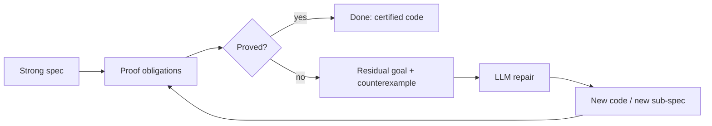

# <span class="text-white">Vericoding with Axiomander</span>

### <span class="text-white opacity-90">Specification is the control surface.</span>
### <span class="text-white opacity-90">Code is a derived artifact.</span>
### <span class="text-white opacity-90">Correctness requires proof.</span>

<div class="abs-br m-6 text-sm text-white opacity-60">
Scidonia · Axiomander 🦎
</div>

---

# The optimism problem

LLMs are **trained to satisfy the prompt**, not to be correct.

<v-clicks>

- They produce code that *looks* like a solution to the request.
- They are systematically **optimistic**: edge cases, error paths, and invariants get glossed.
- "It compiles and the happy path runs" is treated as success.
- The failure mode is silent: plausible code that is subtly wrong.

</v-clicks>

<v-click>

<div class="mt-8 p-4 rounded border border-amber-500/40 bg-amber-500/10">

The model optimises for <b>apparent</b> intent satisfaction.
We need a way to test <b>actual</b> intent satisfaction — <b>deterministically</b>.

</div>

</v-click>

---

# The ladder of guarantees

How strongly can we pin down intent?

| Mechanism | Catches | Misses |
|---|---|---|
| Prompt review | gross misunderstanding | everything subtle |
| Types | shape errors | values, relations, invariants |
| Tests | the cases you thought of | the cases you didn't |
| **Strong specification** | **anything expressible as a property** | **only what you leave unstated** |

<v-click>

<div class="mt-6">

Types and tests are *samples* of intent.
A **strong specification** makes intent **explicit and mechanically checkable** over *all* inputs — and it can be **proved**, not sampled.

</div>

</v-click>

---

# Tests sample. Proofs quantify.

<div grid="~ cols-2 gap-6" class="mt-4">

<div>

### A test

```python
def test_clamp():
    assert clamp(5, 0, 10) == 5
    assert clamp(-3, 0, 10) == 0
    assert clamp(99, 0, 10) == 10
```

A finite set of points.
Green means *these three* are right.

</div>

<div>

### A specification

$$\forall\, v, lo, hi.\;\; lo \le hi \;\Rightarrow\; lo \le \mathrm{clamp}(v,lo,hi) \le hi$$

A statement over **all** inputs.
Proved means *every* input is right.

</div>

</div>

<v-click>

<div class="mt-8 text-center text-xl">

A passing test is evidence. <b>A proof is a guarantee.</b>

</div>

</v-click>

<v-click>

<div class="mt-3 text-center text-sm opacity-70">

...a guarantee <b>relative to the specification</b>. Proof establishes correctness w.r.t. the spec, not w.r.t. unstated intent — so the spec itself becomes the artifact we must get right.

</div>

</v-click>

---

# The spec is now the thing to get right

Proof moves the burden, it doesn't remove it. Correctness is **relative to the specification**, so a spec can still:

<v-clicks>

- omit a requirement, or encode a wrong assumption;
- over-constrain (reject valid behaviour) or under-constrain (allow wrong behaviour).

</v-clicks>

<v-click>

<div class="mt-6 p-4 rounded border border-amber-500/40 bg-amber-500/10">

This is a feature of *where the work goes*, not a hole. The reviewable surface shrinks from "all the code" to "the contracts" — and the contracts are small, declarative, and the explicit object of review.

</div>

</v-click>

---

# What "vericoding" means

<div class="mt-6 text-lg">

A development loop in which:

</div>

<v-clicks>

1. The human writes and iterates on a **strong specification**.
2. An LLM proposes an **implementation** to satisfy it.
3. A **verifier** decides — deterministically — whether the code meets the spec.
4. On failure, the verifier returns a **structured residual** that drives the next attempt.

</v-clicks>

<v-click>

<div class="mt-8 p-4 rounded border border-emerald-500/40 bg-emerald-500/10">

The spec is the thing you maintain. The code is generated, checked, and regenerated underneath it.

</div>

</v-click>

---

# The heal-loop

The verifier doesn't just say "no" — it says **why**, in a form the LLM can act on.



<v-clicks>

- A counterexample is a **concrete witness** of failure — typed values, not vibes.
- A residual goal is the **exact remaining obligation** with its hypotheses.
- The LLM repairs against the residual, not the original prompt.

</v-clicks>

---

# Why the heal-loop beats re-prompting

<div grid="~ cols-2 gap-6" class="mt-4">

<div>

### Naive: "try again"

```text
LLM: here is code
human: it's wrong
LLM: here is different code
human: still wrong
...
```

No signal. The model guesses again.

</div>

<div>

### Heal-loop: drive on residual

```text
Goal:
  lo <= result <= hi
Hyp:
  val > hi
Counterexample:
  result = val  (= 99, > hi)
```

The model gets the **failing fact**. It fixes *that*.

</div>

</div>

<v-click>

<div class="mt-6 text-center">

Determinism turns "convince a reviewer" into "close a goal."

</div>

</v-click>

---

# Composability enables scaling

If every edit re-checked the whole program, vericoding would not scale.

<v-clicks>

- **Iteration cost.** You change one spec; you should re-verify *only* what depends on it.
- **Stubbing.** A library you can't verify is replaced by its **contract**. Callers prove against the stub's axioms.
- **Locality of trust.** A function's body can change freely as long as its contract is stable — callers are untouched.

</v-clicks>

<v-click>

<div class="mt-10 grid grid-cols-2 gap-4 text-center">
  <div class="p-5 rounded-lg border border-sky-500/40 bg-sky-500/10">
    <div class="text-2xl font-bold text-sky-400">Body changes</div>
    <div class="text-lg mt-1">invalidate local proofs</div>
  </div>
  <div class="p-5 rounded-lg border border-emerald-500/40 bg-emerald-500/10">
    <div class="text-2xl font-bold text-emerald-400">Contract changes</div>
    <div class="text-lg mt-1">invalidate callers</div>
  </div>
</div>

</v-click>

---

# The argument in one slide

<v-clicks>

- LLMs are **optimistic**; they satisfy the prompt, not the intent.
- Types and tests **sample** intent; a strong specification makes it **explicit and checkable**.
- Make the **specification the control surface** — iterate on it, derive code under it.
- A **heal-loop** drives the LLM on residual goals and counterexamples, not re-prompts.
- The LLM has freedom in **sub-specification**; helpers get contracts, checked the same way.
- **Composability** (frame rule + contract hashing) makes iteration and **stubbing** scale.
- The Axiomander stack — **LLM + Rocq + Iris + Python** — reduces all of this to soundly-checked proof obligations.

</v-clicks>

<v-click>

<div class="mt-6 text-center text-xl font-bold">

Specification is the control surface. Code is a derived artifact. Correctness requires proof.

</div>

</v-click>

---

layout: center
class: text-center

# Thank you

### Axiomander 🦎
Iterated specification management for Python.

<div class="mt-6 text-sm opacity-70">
github.com/scidonia/axiomander
</div>

<div class="abs-br m-6 text-xs opacity-50">
See the whitepaper: docs/whitepaper.md
</div>
