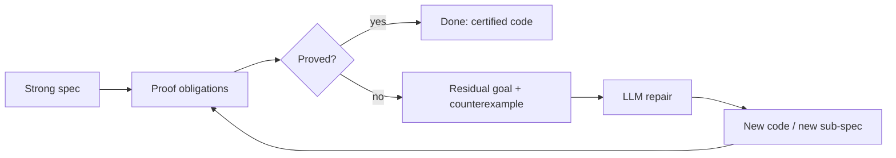
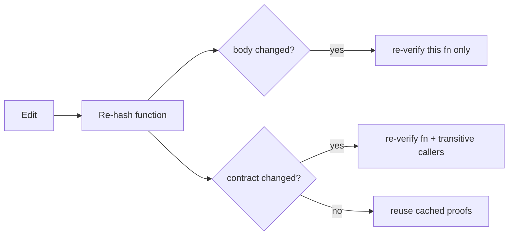

# <span class="text-white">Vericoding with Axiomander</span>

### <span class="text-white opacity-90">Specification is the control surface.</span>
### <span class="text-white opacity-90">Code is a derived artifact.</span>
### <span class="text-white opacity-90">Correctness requires proof.</span>

<div class="abs-br m-6 text-sm text-white opacity-60">
Scidonia · Axiomander 🦎
</div>

<!--
Three slogans frame the whole talk. We will defend each in turn:
- specification is the control surface (you iterate on the spec, not the code)
- code is a derived artifact (the LLM writes it under a heal-loop)
- correctness requires proof (not types, not tests - proof)
-->

---
layout: section
---

# Part I
## Why Vericoding?

---

# The optimism problem

LLMs are **trained to satisfy the prompt**, not to be correct.

<v-clicks>

- They produce code that *looks* like a solution to the request.
- They are systematically **optimistic**: edge cases, error paths, and invariants get glossed.
- "It compiles and the happy path runs" is treated as success.
- The failure mode is silent: plausible code that is subtly wrong.

</v-clicks>

<v-click>

<div class="mt-8 p-4 rounded border border-amber-500/40 bg-amber-500/10">

The model optimises for <b>apparent</b> intent satisfaction.
We need a way to test <b>actual</b> intent satisfaction — <b>deterministically</b>.

</div>

</v-click>

---

# The ladder of guarantees

How strongly can we pin down intent?

| Mechanism | Catches | Misses |
|---|---|---|
| Prompt review | gross misunderstanding | everything subtle |
| Types | shape errors | values, relations, invariants |
| Tests | the cases you thought of | the cases you didn't |
| **Strong specification** | **anything expressible as a property** | **only what you leave unstated** |

<v-click>

<div class="mt-6">

Types and tests are *samples* of intent.
A **strong specification** makes intent **explicit and mechanically checkable** over *all* inputs — and it can be **proved**, not sampled.

</div>

</v-click>

---

# Tests sample. Proofs quantify.

<div grid="~ cols-2 gap-6" class="mt-4">

<div>

### A test

```python
def test_clamp():
    assert clamp(5, 0, 10) == 5
    assert clamp(-3, 0, 10) == 0
    assert clamp(99, 0, 10) == 10
```

A finite set of points.
Green means *these three* are right.

</div>

<div>

### A specification

$$\forall\, v, lo, hi.\;\; lo \le hi \;\Rightarrow\; lo \le \mathrm{clamp}(v,lo,hi) \le hi$$

A statement over **all** inputs.
Proved means *every* input is right.

</div>

</div>

<v-click>

<div class="mt-8 text-center text-xl">

A passing test is evidence. <b>A proof is a guarantee.</b>

</div>

</v-click>

<v-click>

<div class="mt-3 text-center text-sm opacity-70">

...a guarantee <b>relative to the specification</b>. Proof establishes correctness w.r.t. the spec, not w.r.t. unstated intent — so the spec itself becomes the artifact we must get right.

</div>

</v-click>

---

# The spec is now the thing to get right

Proof moves the burden, it doesn't remove it. Correctness is **relative to the specification**, so a spec can still:

<v-clicks>

- omit a requirement, or encode a wrong assumption;
- over-constrain (reject valid behaviour) or under-constrain (allow wrong behaviour).

</v-clicks>

<v-click>

<div class="mt-6 p-4 rounded border border-amber-500/40 bg-amber-500/10">

This is a feature of *where the work goes*, not a hole. The reviewable surface shrinks from "all the code" to "the contracts" — and the contracts are small, declarative, and the explicit object of review.

</div>

</v-click>

<v-click>

<div class="mt-4 text-sm opacity-80">

<b>Future work:</b> tooling to test the <i>meaning</i> of a specification — exercising it with examples, checking satisfiability and non-vacuity, surfacing over/under-constraint — potentially <b>before</b> any code is written.

</div>

</v-click>

---

# What "vericoding" means

<div class="mt-6 text-lg">

A development loop in which:

</div>

<v-clicks>

1. The human writes and iterates on a **strong specification**.
2. An LLM proposes an **implementation** to satisfy it.
3. A **verifier** decides — deterministically — whether the code meets the spec.
4. On failure, the verifier returns a **structured residual** that drives the next attempt.

</v-clicks>

<v-click>

<div class="mt-8 p-4 rounded border border-emerald-500/40 bg-emerald-500/10">

The spec is the thing you maintain. The code is generated, checked, and regenerated underneath it.

</div>

</v-click>

---
layout: section
---

# Part II
## The Methodology

---

# Specification is the control surface

<div class="mt-4 text-lg">

You steer the system by editing the **specification**, not the code.

</div>

<div grid="~ cols-2 gap-8" class="mt-6">

<div>

### Traditional

<div class="flex flex-col items-center gap-1 text-sm mt-2">
  <div class="px-4 py-2 rounded border border-violet-400/40 bg-violet-400/10">Human</div>
  <div class="text-xs text-gray-400">writes ↓</div>
  <div class="px-4 py-2 rounded border border-violet-400/40 bg-violet-400/10">Code <span class="text-xs opacity-60">(Tests sample it)</span></div>
  <div class="text-xs text-gray-400">hopefully ↓</div>
  <div class="px-4 py-2 rounded border border-gray-400/40 bg-gray-400/10">Intent</div>
</div>

<div class="mt-3 text-center text-sm">Code is the artifact you edit and trust.</div>

</div>

<div>

### Vericoding

<div class="flex flex-col items-center gap-1 text-sm mt-2">
  <div class="px-4 py-2 rounded border border-violet-400/40 bg-violet-400/10">Human</div>
  <div class="text-xs text-gray-400">writes ↓</div>
  <div class="px-4 py-2 rounded border border-emerald-500/40 bg-emerald-500/10 font-semibold">Specification</div>
  <div class="text-xs text-gray-400">drives ↓</div>
  <div class="px-4 py-2 rounded border border-sky-500/40 bg-sky-500/10">LLM</div>
  <div class="text-xs text-gray-400">emits ↓</div>
  <div class="px-4 py-2 rounded border border-violet-400/40 bg-violet-400/10">Code</div>
  <div class="text-xs text-amber-500">Verifier: proves Code ⊨ Spec ↺</div>
</div>

<div class="mt-3 text-center text-sm">Spec is the artifact. Code is <b>derived</b>.</div>

</div>

</div>

---

# Code is a derived artifact

<v-clicks>

- The implementation is **disposable**. If it doesn't verify, throw it away and regenerate.
- The spec persists across many implementations.
- This inverts the usual trust relationship: we don't trust the code because we read it — we trust it because it was **proved** against a spec we *did* read.
- The reviewable surface shrinks from "all the code" to "the contracts at the boundary."

</v-clicks>

<v-click>

<div class="mt-8">

$$\underbrace{(P, Q)}_{\text{spec, human-authored}} \quad\leadsto\quad \underbrace{c}_{\text{code, LLM-derived}} \quad\text{such that}\quad \vDash \{P\}\, c \,\{Q\}$$

<div class="text-sm opacity-70 mt-2 text-center">
The human authors <b>both</b> halves of the spec: the assumption <i>P</i> on inputs and the guarantee <i>Q</i> on outputs.
The code is derived to make <i>Q</i> hold <b>under</b> <i>P</i> — we supply only <i>P</i>-constrained inputs.
</div>

</div>

</v-click>

---

# Correctness requires proof

<div class="mt-4 text-lg">

A specification is only as good as our ability to **discharge** it.

</div>

<v-clicks>

- Runtime contracts catch violations *after* deployment, on inputs you happened to hit.
- Static proof catches violations *before* deployment, on **all** inputs.
- Axiomander reduces "does the code meet the spec?" to a **Rocq proof obligation** — a binary, deterministic verdict.

</v-clicks>

<v-click>

$$\{P\}\;c\;\{Q\} \;\;\equiv\;\; \forall s.\; P(s) \Rightarrow \mathrm{wp}\,(c, Q)(s)$$

<div class="text-sm opacity-70 mt-2">
Here <b>wp(c, Q)</b> is the <b>weakest precondition</b> (WP) calculus — the weakest predicate that must hold before command <i>c</i> so that postcondition <i>Q</i> holds after. The Hoare triple holds iff the precondition <i>P</i> implies <b>wp(c, Q)</b>. Proved sound in Rocq.
</div>

</v-click>

---

# The heal-loop

The verifier doesn't just say "no" — it says **why**, in a form the LLM can act on.



<v-clicks>

- A counterexample is a **concrete witness** of failure — typed values, not vibes.
- A residual goal is the **exact remaining obligation** with its hypotheses.
- The LLM repairs against the residual, not the original prompt.

</v-clicks>

---

# Why the heal-loop beats re-prompting

<div grid="~ cols-2 gap-6" class="mt-4">

<div>

### Naive: "try again"

```text
LLM: here is code
human: it's wrong
LLM: here is different code
human: still wrong
...
```

No signal. The model guesses again.

</div>

<div>

### Heal-loop: drive on residual

```text
Goal:
  lo <= result <= hi
Hyp:
  val > hi
Counterexample:
  result = val  (= 99, > hi)
```

The model gets the **failing fact**. It fixes *that*.

</div>

</div>

<v-click>

<div class="mt-6 text-center">

Determinism turns "convince a reviewer" into "close a goal."

</div>

</v-click>

---

# End-to-end: one turn of the loop

<div grid="~ cols-2 gap-5" class="text-xs mt-2">

<div>

**1. Human writes the spec**

```python
def clamp(v: int, lo: int, hi: int) -> int:
    assert lo <= hi                 # pre
    ...
    assert lo <= result <= hi       # post
    return result
```

**2. LLM emits code (optimistic, wrong)**

```python
    if v < lo: result = lo
    else:      result = v      # forgot the hi case!
```

</div>

<div>

**3. Verifier returns a residual + counterexample**

```text
Goal:  lo <= result <= hi
Hyp:   v > hi
CEX:   v=99, lo=0, hi=10  ->  result=99  > hi
```

**4. LLM repairs against the failing fact**

```python
    if v < lo:   result = lo
    elif v > hi: result = hi   # added
    else:        result = v
```

**5. Re-verify -> 6. `Qed`** &nbsp; <span class="text-emerald-400">certified</span>

</div>

</div>

<v-click>

<div class="mt-2 text-sm opacity-80 text-center">
The model never saw the prompt again — only the residual goal and the counterexample. That is the whole loop.
</div>

</v-click>

---

# Freedom in sub-specification

To prove the **entry point**, the LLM must specify the **helpers** it introduces.

<v-clicks>

- The human writes the top-level contract — the *one surface of understanding*.
- The LLM is free to decompose: introduce helper functions, each with **its own** contract.
- Those sub-specifications are the LLM's degrees of freedom — they are how it makes the global proof go through.
- Sub-specs are checked the same way. There is no privileged, unverified layer.

</v-clicks>

<v-click>

$$
\frac{\{P_g\}\,g\,\{Q_g\} \qquad \{P_f\}\,f\,\{Q_f\}\ \text{using}\ Q_g}{\{P_f\}\,f\,\{Q_f\}}
$$

<div class="text-sm opacity-70 mt-2">
The caller's proof uses only the callee's <b>contract</b> <span class="font-mono">Q_g</span>, never its body.
</div>

</v-click>

---

# Sub-specification is free — and self-correcting

"What stops the LLM inventing vacuous or weak helper contracts?" Nothing — and it doesn't matter.

<v-clicks>

- Sub-specification is **completely free**: the LLM may write any helper contracts it likes.
- A **weak** sub-spec simply *fails to prove the control spec* — unless that helper was irrelevant to it. Bad sub-specs do no damage; they just don't close the goal.
- So the LLM is **incentivised toward strong sub-specs**: stronger lower-level guarantees are what make the weaker, higher-level goal provable.

</v-clicks>

<v-click>

<div class="mt-6 p-5 rounded border border-emerald-500/40 bg-emerald-500/10 text-xl leading-relaxed">

The control specification is the gatekeeper. It cannot be discharged by leaning on under-powered sub-specs — the proof obligation forces honesty all the way down.

</div>

</v-click>

---

# Composability enables scaling

If every edit re-checked the whole program, vericoding would not scale.

<v-clicks>

- **Iteration cost.** You change one spec; you should re-verify *only* what depends on it.
- **Stubbing.** A library you can't (or won't) verify is replaced by its **contract**. Callers prove against the stub's axioms.
- **Locality of trust.** A function's body can change freely as long as its contract is stable — callers are untouched.

</v-clicks>

<v-click>

<div class="mt-10 grid grid-cols-2 gap-4 text-center">
  <div class="p-5 rounded-lg border border-sky-500/40 bg-sky-500/10">
    <div class="text-2xl font-bold text-sky-400">Body changes</div>
    <div class="text-lg mt-1">invalidate local proofs</div>
  </div>
  <div class="p-5 rounded-lg border border-emerald-500/40 bg-emerald-500/10">
    <div class="text-2xl font-bold text-emerald-400">Contract changes</div>
    <div class="text-lg mt-1">invalidate callers</div>
  </div>
</div>

</v-click>

---

# Composition, formally

A contract is an **interface**; a proof is a **cached build artifact**.

$$
\mathrm{summary}(g) = \mathrm{hash}\big(\text{pre},\ \text{post},\ \text{reads},\ \text{writes},\ \text{raises}\big)
$$

<v-clicks>

- Caller $f$ depends on $\mathrm{summary}(g)$ — **not** on $g$'s implementation.
- $g$'s body changes, $\mathrm{summary}(g)$ stable $\Rightarrow$ $f$'s proof is **reused**.
- $\mathrm{summary}(g)$ changes $\Rightarrow$ re-verify $f$ and its transitive callers only.

</v-clicks>

<v-click>

<div class="mt-6 text-center text-lg">

The verifier becomes <b>a build system for correctness</b>, not a batch theorem prover.

</div>

</v-click>

---

# Stubbing libraries as axioms

You don't verify `dict.get`. You **declare its contract** and prove against it.

```python
# stubs/builtins.pyi  — the contract, not the implementation
def get(d: dict, k, default):
    """
    axiomander:
        ensures:
            implies(k in d, result == d[k])
            implies(k not in d, result == default)
        modifies:
            none
    """
```

<v-clicks>

- The stub's `ensures` becomes an **axiom** available to callers.
- The trust boundary is **explicit and small**: it's the stub, written once, reviewed once.
- Replacing optimism ("the LLM probably calls `get` correctly") with an enforced contract.

</v-clicks>

---
layout: section
---

# Part III
## The Axiomander Architecture

---

# The stack

$$\textbf{Axiomander} \;=\; \text{LLM} \;+\; \text{Rocq} \;+\; \text{Iris} \;+\; \text{Python}$$

<div class="mt-4">

| Layer | Role |
|---|---|
| **Python** | source language — contracts are plain `assert` / `axiomander:` docstrings |
| **Rocq** | the proof assistant (formerly Coq) — the **trust kernel**, final authority |
| **Iris** | on Rocq — useful for **separation logic, resource management, concurrency** |
| **LLM** | the **oracle** — closes residual goals, proposes code & sub-specs, never the trust kernel |

</div>

<v-click>

<div class="mt-4 p-3 rounded border border-sky-500/40 bg-sky-500/10">

<b>Rocq is one possible backend.</b> Vericoding is backend-agnostic — any assistant that returns a sound verdict + a structured residual works.

</div>

</v-click>

---

# From Python to a proof obligation

<div class="grid grid-cols-[1fr_auto] gap-x-8 items-center mt-4 text-sm">

<div class="flex flex-col gap-2">
  <div class="px-4 py-2 rounded border border-gray-400/40 bg-gray-400/10 font-mono">Python asserts / <span class="font-mono">axiomander:</span> docstrings</div>
  <div class="text-center text-gray-400">↓</div>
  <div class="px-4 py-2 rounded border border-gray-400/40 bg-gray-400/10"><span class="font-mono">contract_linter.py</span> &rarr; Contract IR</div>
  <div class="text-center text-gray-400">↓</div>
  <div class="px-4 py-2 rounded border border-gray-400/40 bg-gray-400/10"><span class="font-mono">py_to_imp.py</span> &rarr; IMP body</div>
  <div class="text-center text-gray-400">↓</div>
  <div class="px-4 py-2 rounded border border-gray-400/40 bg-gray-400/10"><span class="font-mono">obligation_gen.py</span> &rarr; Rocq obligations</div>
</div>

<div class="flex flex-col gap-2 justify-center">
  <div class="px-4 py-2 rounded border border-emerald-500/40 bg-emerald-500/10"><b>Level 1</b> &middot; deterministic Rocq</div>
  <div class="text-center text-amber-400 text-xs">residual ↓</div>
  <div class="px-4 py-2 rounded border border-emerald-500/40 bg-emerald-500/10"><b>Level 2</b> &middot; SMT / Hammer</div>
  <div class="text-center text-amber-400 text-xs">residual ↓</div>
  <div class="px-4 py-2 rounded border border-emerald-500/40 bg-emerald-500/10"><b>Level 2b</b> &middot; theory-SMT (strings / regex / floats)</div>
  <div class="text-center text-amber-400 text-xs">residual ↓</div>
  <div class="px-4 py-2 rounded border border-emerald-500/40 bg-emerald-500/10"><b>Level 3</b> &middot; rocq-piler + LLM oracle</div>
  <div class="text-center text-sky-400 text-xs">each tier may discharge &rarr; <b>Certified</b></div>
</div>

</div>

<div class="text-sm opacity-70 mt-4">
Contracts are plain <span class="font-mono">assert</span> statements or verifier-only <span class="font-mono">axiomander:</span> docstring blocks — zero imports, zero decorators. Cheap deterministic tactics run first; the LLM is the fallback.
</div>

---

# Contracts as ordinary Python

No decorators. No imports. The user's code stays dependency-free.

```python
def clamp(val: int, lo: int, hi: int) -> int:
    assert lo <= hi                       # precondition
    if val < lo:    result = lo
    elif val > hi:  result = hi
    else:           result = val
    assert lo <= result <= hi             # postcondition
    assert implies(val < lo, result == lo)
    assert implies(val > hi, result == hi)
    return result
```

<v-clicks>

- Leading asserts → preconditions. Trailing asserts → postconditions. Loop-body asserts → invariants.
- The richer `axiomander:` docstring carries `requires / ensures / reads / modifies / raises / units`.
- The linter classifies by **position** and lowers to the Contract IR.

</v-clicks>

---

# The intermediate language: IMP

We don't prove properties of arbitrary Python. We lower a verified subset to **IMP**.

<div grid="~ cols-2 gap-6">

<div>

$$
\begin{aligned}
e ::=&\ n \mid x \mid e_1 + e_2 \mid e_1 < e_2 \mid \dots \\[4pt]
c ::=&\ \mathsf{skip} \mid x := e \mid c_1 ; c_2 \\
   &\mid \mathsf{if}\ e\ \mathsf{then}\ c_1\ \mathsf{else}\ c_2 \\
   &\mid \mathsf{while}\ e\ \mathsf{inv}\ I\ \mathsf{do}\ c \\
   &\mid \mathsf{assert}\ P
\end{aligned}
$$

</div>

<div>

- Values: `VZ | VBool | VUnit` plus structural `VList | VTuple | VDict`.
- Mutation works on a heap representation that **parallels** the immutable value.
- IMP is small enough to formalise and prove sound; rich enough to cover the verified subset.

</div>

</div>

---

# The supported Python fragment

A **large** fragment — large enough to instruct the LLM to write within it, and to **retroactively annotate** many existing Python functions.

<div grid="~ cols-3 gap-4" class="mt-4 text-sm">

<div class="p-3 rounded border border-emerald-500/40 bg-emerald-500/10">

**Supported now**

- assignments, `if`/`elif`/`else`
- `while`, `for ... in range`
- function calls + frames
- `list` / `dict` / `set`, `str`, `bytes`
- `int` / `float` / `bool` / `None`
- exceptions (raise as outcomes)
- `isinstance` dispatch
- classes / Pydantic fields

</div>

<div class="p-3 rounded border border-sky-500/40 bg-sky-500/10">

**On the roadmap**

- **concurrency** — separation logic is built for it
- **generators** — coinductive proofs at the generator, **composed** at call sites
- closures, richer iterators
- more of the stdlib via stubs
- wider numeric / string theory

</div>

<div class="p-3 rounded border border-rose-500/40 bg-rose-500/10">

**Resists a contract**

- reflection / introspection
- monkey-patching, `eval`
- truly arbitrary dynamic dispatch

</div>

</div>

<v-click>

<div class="mt-3 text-sm opacity-80">
Most of Python is reachable. The hard cases (concurrency, generators) are <b>roadmap, not walls</b> — they compose into the same contract framework. Only genuinely non-analysable behaviour resists a contract, and it is <b>rejected, not silently mis-modelled</b>.
</div>

</v-click>

---

# Weakest precondition (WP) calculus

The single source of truth — proven sound in Rocq. $\mathrm{wp}(c, Q)$ computes the weakest precondition of command $c$ w.r.t. postcondition $Q$, by structural recursion on $c$:

$$
\begin{aligned}
\mathrm{wp}(\mathsf{skip}, Q) &= Q \\
\mathrm{wp}(x := e, Q) &= Q[x \mapsto e] \\
\mathrm{wp}(c_1 ; c_2, Q) &= \mathrm{wp}(c_1,\ \mathrm{wp}(c_2, Q)) \\
\mathrm{wp}(\mathsf{if}\ e\ \mathsf{then}\ c_1\ \mathsf{else}\ c_2, Q) &= (e \Rightarrow \mathrm{wp}(c_1,Q)) \wedge (\neg e \Rightarrow \mathrm{wp}(c_2,Q)) \\
\mathrm{wp}(\mathsf{while}\ e\ \mathsf{inv}\ I\ \mathsf{do}\ c, Q) &= I
\end{aligned}
$$

<v-click>

For loops, the invariant generates two verification conditions:

$$
\text{VC}_1:\ I \wedge \neg e \Rightarrow Q
\qquad\qquad
\text{VC}_2:\ I \wedge e \Rightarrow \mathrm{wp}(c, I)
$$

</v-click>

---

# Soundness (w.r.t. the modeled semantics)

The theorem that makes the verdict trustworthy — over IMP's **modeled** big-step semantics, not Python's runtime directly:

$$
\{P\}\,c\,\{Q\} \;\;\Longleftrightarrow\;\; \big(\forall s.\; P(s) \Rightarrow \mathrm{wp}(c, Q)(s)\big)
$$

<div class="text-sm opacity-70 mt-1">Proved in Rocq by induction on the structure of <span class="font-mono">c</span>. The Python-to-IMP lowering is part of the trust base (next slide).</div>

<v-click>

So for a function `f(x)` with precondition `P` and postcondition `Q`, the obligation is:

$$
\forall x.\; P(x) \;\Rightarrow\; \mathrm{wp}\big(c,\ \lambda\, \mathit{result}.\ Q(x, \mathit{result})\big)
$$

</v-click>

<v-click>

```coq
Theorem f_correct : forall x, P x -> wp c (fun result => Q x result).
Proof.
  (* discharged by the tiered pipeline *)
Qed.
```

</v-click>

---

# The trust base

A proof is only as trustworthy as what it rests on. Axiomander's TCB:

<div grid="~ cols-2 gap-6" class="mt-3 text-sm">

<div>

**Trusted** (the TCB)

- **Rocq kernel** — the proof checker
- **IMP semantics + WP calculus** — proven sound *in Rocq*
- **Python → IMP lowering** — extractable from Rocq later
- **Stubs / SMT axioms** — each is an assumption

</div>

<div>

**Not trusted**

- **LLM-generated proofs** — re-checked by Rocq
- **Generated obligations** — mechanically derived

</div>

</div>

<v-click>

<div class="mt-4 p-3 rounded border border-rose-500/40 bg-rose-500/10 text-sm">

<b>Warning:</b> a single unsound stub or SMT axiom invalidates every proof that uses it — the sharpest edge of the TCB. The LLM is <i>untrusted</i>: its output is always re-checked.

</div>

</v-click>

---

# Frames: calls reason from contracts

A callee's `modifies:` set is its **write frame**. Callers rely on everything outside it being preserved.

```python
def inc(x: int) -> int:
    """ axiomander:
        requires: x >= 0
        modifies: none
        ensures:  result == x + 1 """
    result = x + 1
    return result

def frame_two_calls(a: int, b: int) -> int:
    """ axiomander:
        ensures: a == old(a); b == old(b); result == a + b + 2 """
    a2 = inc(a); b2 = inc(b)
    result = a2 + b2
    return result
```

<v-click>

The CCall rule proves $\forall v.\ v \notin (\textit{target} :: \textit{writes}) \Rightarrow v' = v$ — unlisted variables are frame-preserved.

</v-click>

---

# The frame rule

This is what makes proofs **local** — the heart of composability.

$$
\frac{\{P\}\,c\,\{Q\} \qquad \mathrm{modifies}(c) \cap \mathrm{free}(R) = \varnothing}{\{P \wedge R\}\,c\,\{Q \wedge R\}}
$$

<v-clicks>

- $R$ is any assertion about variables the callee doesn't touch — it survives the call **for free**.
- The caller never unfolds the callee's body; it uses only the contract + frame.
- Axiomander generates per-callee frame lemmas so each `apply` fires independently with its own residual on failure.

</v-clicks>

---

# The proof pipeline: three tiers

| Level | Mechanism | Handles |
|---|---|---|
| **1** | deterministic Rocq (`wp_reduce`, `lia`) | assignments, conditionals, loops, frame/CCall obligations — ~80% of goals |
| **2** | SMT / Rocq-hammer (cvc4, cvc5, eprover) | linear & non-linear arithmetic, first-order residuals |
| **2b** | theory-SMT (Z3 / CVC5 `QF_SLIA`) | strings, contains/prefix, **regex subsumption**, float dimensions |
| **3** | rocq-piler + LLM oracle | loop invariants, induction, deep lemma chains |

<v-click>

<div class="mt-4 text-center">

Cheap, deterministic tactics first. The LLM is the **fallback**, not the first resort.

</div>

</v-click>

---

# Staged obligations, never one giant theorem

> Never lose partial proof work. A failed attempt produces reusable artifacts, not dead ends.

<v-clicks>

- Each obligation has a **stable identifier**: `sort.insert.preserves_sorted.branch_2`.
- A failed stage emits a **residual goal** with hypotheses — exactly what the LLM needs.
- The LLM operates on the **residual proof state**, not the original program.
- Per-obligation caching, parallelisation, and fine-grained reuse all fall out of this.

</v-clicks>

<v-click>

```text
Context:  xs_sorted : sorted(xs)
          pivot_le_head : pivot <= head(xs)
Goal:     sorted(pivot :: xs)
```

</v-click>

---

# Failure is information

Two kinds of negative result, both of which feed the heal-loop. In the **decidable / SMT-attacked** fragment, a false goal yields a *concrete typed counterexample*:

<div grid="~ cols-2 gap-6" class="mt-4">

<div>

### Theory-SMT (regex)

```python
def accept(p: str) -> str:
    """ axiomander:
        requires: p.re_match("[0-9]{3}")
        ensures:  result.re_match("[a-z]+") """
    result = p
    return result
```

</div>

<div>

### Verdict

```text
COUNTEREXAMPLE
  result = "000"
  satisfies requires-regex
  violates  ensures-regex
```

A digit string can never match `[a-z]+`.

</div>

</div>

<v-click>

<div class="text-sm mt-2">

Dimensional analysis is the same: mixing `[USD]` and `[GBP]` is a typed dimension error — rejected before the proof runs.

</div>

</v-click>

<v-click>

<div class="mt-4 p-3 rounded border border-sky-500/40 bg-sky-500/10 text-sm">

Beyond the decidable fragment, a failed proof leaves a **residual goal with hypotheses** rather than a counterexample. That residual is itself an asset — it tells the LLM *why* the spec couldn't be discharged, and is exactly what drives repair. <b>Future work:</b> proving the *negation* to certify that a contract is unsatisfiable for a given implementation.

</div>

</v-click>

---

# Incremental verification = a build system for correctness



<div class="text-sm mt-4">

| Change | Re-verify |
|---|---|
| body only | the function |
| local assert / invariant | the function |
| **contract** | the function + direct + transitive callers |
| **callee contract** (`summary` hash) | the caller |

</div>

---

# Dogfooding: Axiomander verifies itself

The function that decides whether a goal passed — carries a contract and proves at Level 1.

```python
def is_proved(self) -> bool:
    """ axiomander:
        ensures:
          implies(self.level == ProofLevel.UNPROVED, result == False)
          implies(self.level == ProofLevel.COUNTEREXAMPLE, result == False)
          implies(self.level != ProofLevel.UNPROVED
                  and self.level != ProofLevel.COUNTEREXAMPLE, result == True)
    """
    return self.level not in (ProofLevel.UNPROVED, ProofLevel.COUNTEREXAMPLE)
```

<v-click>

Enum names, `implies()` per case, attribute access (`self.level`), and `not in` over a tuple — all lowered to IMP and discharged deterministically. Plus 16+ other self-verified functions.

</v-click>

---

# Tooling: verification in the editor (MCP)

Axiomander is an **MCP server** — verification lives where you write code.

| Tool | What it does |
|---|---|
| `check-function` | verify a single function (Level 1) + suggest contracts |
| `verify-function` | full verification (Level 1 → 2 → 3) |
| `verify-changed` | incremental — re-verify only changed functions |
| `verify-impacted` | dry-run — show what *would* re-verify |
| `explain-cache` | why a proof was reused or regenerated |
| `frame-report` | pre/post/invariant + frame conditions |

<div class="text-sm opacity-70 mt-3">
First run compiles Rocq (seconds); subsequent runs hit the cache (milliseconds).
</div>

---
layout: section
---

# Part IV
## What This Buys You

---

# Threats to validity

Where this can go wrong — stated plainly:

<div grid="~ cols-2 gap-6" class="mt-4 text-base">

<div>

- **Specification bugs.** Proof is *relative to the spec*; a wrong spec yields confidently-wrong code. (Mitigation: small reviewable contracts; future spec-meaning tooling.)
- **Unsound stubs / axioms.** One bad assumption invalidates downstream proofs. (Mitigation: explicit, minimal, reviewed TCB.)
- **Translation bugs.** Python -> IMP lowering is trusted. (Mitigation: small verified subset; extract from Rocq later.)

</div>

<div>

- **Unsupported features.** Constructs outside the fragment are rejected, not mis-modelled — but they *are* rejected.
- **Proof-engineering cost.** Hard goals may need invariants/lemmas the LLM can't find; the loop can stall on a residual.
- **Modeled vs. runtime semantics.** We prove against IMP's model of Python, not CPython byte-for-byte.

</div>

</div>

<v-click>

<div class="mt-5 p-4 rounded border border-emerald-500/40 bg-emerald-500/10 text-base leading-relaxed">
This is like a <b>software bill of materials — upgraded</b>: instead of a list of components and hoped-for safety, we get a <b>precise, machine-checked trust surface</b> — and it is a surface we can <b>shrink over time</b> (verify a stub, discharge an axiom, extract the translator).
</div>

</v-click>

---

# The argument in one slide

<v-clicks>

- LLMs are **optimistic**; they satisfy the prompt, not the intent.
- Types and tests **sample** intent; a strong specification makes it **explicit and checkable** — proof is correctness *relative to the spec*.
- Make the **specification the control surface** — iterate on it, derive code under it.
- A **heal-loop** drives the LLM on residual goals and counterexamples, not re-prompts.
- The LLM has freedom in **sub-specification**; helpers get contracts, checked the same way.
- **Composability** (frame rule + contract hashing) makes iteration and **stubbing** scale.
- The Axiomander stack — **LLM + Rocq + Iris + Python** — reduces all of this to soundly-checked proof obligations; Rocq is *one* possible backend, the methodology is backend-agnostic.

</v-clicks>

<v-click>

<div class="mt-6 text-center text-xl font-bold">

Specification is the control surface. Code is a derived artifact. Correctness requires proof.

</div>

</v-click>

---
layout: center
class: text-center
---

# Thank you

### Axiomander 🦎
Iterated specification management for Python.

<div class="mt-6 text-sm opacity-70">
github.com/scidonia/axiomander
</div>

<div class="abs-br m-6 text-xs opacity-50">
See the whitepaper: docs/whitepaper.md
</div>
